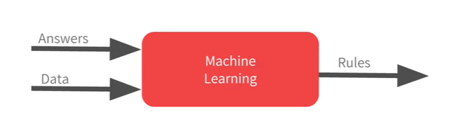

# A New Programming Paradigm

## An Overview
* One of the best tools we can use to implement deep learning and machine learning algorithms is TensorFlow.
* Programming frameworks like TensorFlow, PyTorchm caffe and many others can help us in learning algorithms, moreover they can save a lot of time.
* Deep learning and machine learning skills are becoming ever more important and opening up whole new scenarios.
* Even though the whole world sees the promise and the hope of these machine learning AI capabilities changing so many things, the world just doesn't have enough AI developers today.

## Notebooks for This Course
Ungraded labs and assignment for each week can be found in this [Github repository](https://github.com/https-deeplearning-ai/tensorflow-1-public). 
How to run the notebooks locally:
```
git clone https://github.com/https-deeplearning-ai/tensorflow-1-public
git pull
```
Packages:
```
tensorflow==2.7.0
scikit-learn==1.0.1
pandas==1.1.5
matplotlib==3.2.2
seaborn==0.11.2
```

## A Primer in Machine Learning
<p align="center">
    
</p>
<p align="center"><i>Image 1. Traditional Programming</i></p>

<p align="center">
    
</p>
<p align="center"><i>Image 2. Activity Recognition using Traditional Programming</i></p>

<p align="center">
    
</p>
<p align="center"><i>Image 3. New Programming</i></p>

* Rules are express in a programming language and data can come from a variety of sources from local variables or the way up to databases
* Machine learning is really similar but we only flipping the axes
* Neural network is the workhorse of doing this type of pattern recognition

## The ‘Hello World’ of neural networks
Machine learning is all about a computer learning the patterns that distinguish things. The simplest possible neural network is one that has only one neuron in it, we can see it the code below.

```python
# # In keras, we use Dense to define a layer of connected neurons
model = keras.Sequential([keras.layers.Dense(units=1, input_shape=[1])]) 
model.compile(optimizer='sgd', loss='mean_squared_error')

xs = np.array([-1.0, 0.0, 1.0, 2.0, 3.0, 4.0], dtype=float)
ys = np.array([-3.0, -1.0, 1.0, 3.0, 5.0, 7.0], dtype-float)

# the training takes place in the fit command
# epoch = 500, means that it will go through the training loop 500 times
model.fit(xs, ys, epochs=500)

print(model.predict([10.0]))
```

There are two functions, **loss** and **optimizer**. 
* Loss function measure how good or how bad its guess was. Loss function is mean squarred error.
* Optimizer function figures out the next guess, how good or how badly the guess was done using the data from the loss function. Each guess should be better than the one before. Optimizer is SGD (Stochastic Gradient Descent)

In conclusion, the steps to figure out the patterns are:
1. Make a guess
2. Measure how good or how bad the guesses with the loss function
3. Use the optimizer and the data to make another guess and repeat this

If the result is far from expectation or what you guess before, there are 2 reasons for it.
1. Training data is too small
2. When using neural networks, they deal in probability as they try to figure out the answers for everything.

## From Rules to Data
* Traditional paradigm of expressing rules in a coding language may not always work to solve a problem. Computer vision are very difficult to solve with rules-based programming.
* We can feed a computer with enough data that we describe / label as what we want it to recognize. Example: fitting numbers to a line.

## Get started with Google Colaboratory (Coding TensorFlow)

* One useful notebook collection: [Seedback Project](research.google.com/seedbank)
* Start working with Google Colab: [Welcome to Colaboratory](colab.research.google.com)
* An easy way to learn and use Tensorflow in Colab: [Colab - Tensorflow](https://medium.com/tensorflow/colab-an-easy-way-to-learn-and-use-tensorflow-d74d1686e309)
* Week 1 - Workbook: [Hello World of Deep Learning with Neural Networks](https://github.com/https-deeplearning-ai/tensorflow-1-public/blob/main/C1/W1/ungraded_lab/C1_W1_Lab_1_hello_world_nn.ipynb)

## Week 1 Grading Assignments

* Quiz 1: 
* Programming assignment: 

## Resources
* AI for everyone: [ai-for-everyone-course](https://www.deeplearning.ai/program/ai-for-everyone/)
* Tensorflow: [documentation](https://www.tensorflow.org/) and [youtube](https://www.youtube.com/tensorflow)
* Play with neural networks: [neural-network](http://playground.tensorflow.org/#activation=tanh&batchSize=10&dataset=circle&regDataset=reg-plane&learningRate=0.03&regularizationRate=0&noise=0&networkShape=4,2&seed=0.83151&showTestData=false&discretize=false&percTrainData=50&x=true&y=true&xTimesY=false&xSquared=false&ySquared=false&cosX=false&sinX=false&cosY=false&sinY=false&collectStats=false&problem=classification&initZero=false&hideText=false)