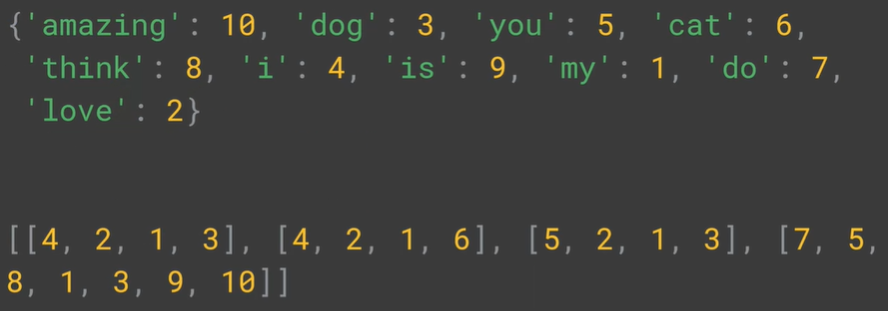
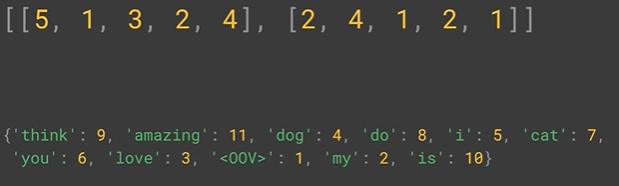
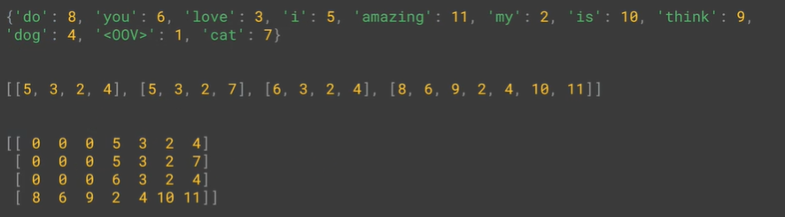

# Sentiment in Text

Unlike images, which come in these regular shaped tensors of pixel intensity values, Text is messier, there are long sentences, there are short sentences. We're going to take a look at what it takes for you to process text because neural networks generally deal in numbers. 

## Introduction
In the earlier, we have learned about:
* Neural networks and how they can match patterns to perform classifications. 
* How to make that a little smarter for images using convolutions to identify the features in the images and classify based on those instead of just matching on raw pixels

In this course, we'll focus on text and how we can build classifier is based on text models. We'll start by looking at sentiment in text, and learn how to build models that understand text that are trained on labeled text, and then can then classify new text based on what they've seen.

## Word Based Encodings
A common simple character encoding is ASCII, the American Standard Code for Information Interchange. But the problem with this of course, is that the semantics of the word aren't encoded in the letters.

## Using APIs
```python
import tensorflow as tf
from tf import keras
from tf.keras.preprocessing.text import Tokenizer

sentences = [
    'I love my dog',
    'I love my cat',
    'You love my dog'
]

# num_words, tokenizer take the top 100 words by volume and encode those
tokenizer = Tokenizer(num_words = 100)

# take the data and encode it
# generate indices for each word in the corpus
tokenizer.fit_on_texts(sentences)

# word_index retrun dictionary containing key value pairs
# key is the word and value is token for the word
word_index = tokenizer.word_index
print(word_index)
# print(f'Found {word_index} uniq words')
```

By default, Tokenizer skips all punctuations and words are converted to lower case

## Text to Sequence
text to sequence is about turn sentences into lists of values based on tokens made before.

```python
import tensorflow as tf
from tf import keras
from tf.keras.preprocessing.text import Tokenizer

sentences = [
    'I love my dog',
    'I love my cat',
    'You love my dog',
    'Do you think my dog is amazing?'
]

tokenizer = Tokenizer(num_words = 100, oov_token="<OOV>")
tokenizer.fit_on_texts(sentences)
word_index = tokenizer.word_index

sequences = tokenizer.texts_to_sequences(sentences)

print(word_index)
print(sequences)
```

Output:


## Looking more at the Tokenizer
We really need a lot of training data to get a broad vocabulary. In many cases, it's a good idea to instead of just ignoring unseen words, to put a special value in when an unseen word is encountered. We will use OOV (out of vocabulary) token.

```python
import tensorflow as tf
from tf import keras
from tf.keras.preprocessing.text import Tokenizer

sentences = [
    'I love my dog',
    'I love my cat',
    'You love my dog',
    'Do you think my dog is amazing?'
]

tokenizer = Tokenizer(num_words = 100, oov_token="<OOV>")
tokenizer.fit_on_texts(sentences)
word_index = tokenizer.word_index

sequences = tokenizer.texts_to_sequences(sentences)

print(word_index)
print(sequences)
```

Output:


## Padding
Working with texts, we needed to have some level of uniformity of size. So, we will use padding.

```python
import tensorflow as tf
from tf import keras
from tf.keras.preprocessing.text import Tokenizer
from tf.keras.preprocessing.sequence import pad_sequences

sentences = [
    'I love my dog',
    'I love my cat',
    'You love my dog',
    'Do you think my dog is amazing?'
]

tokenizer = Tokenizer(num_words = 100, oov_token="<OOV>")
tokenizer.fit_on_texts(sentences)
word_index = tokenizer.word_index

sequences = tokenizer.texts_to_sequences(sentences)

padded = pad_sequences(sequences)

print(word_index)
print(sequences)
print(padded)
```

Output:


Padding parameters
```python
padded = pad_sequences(
    sequences, 
    padding='post', 
    truncating='post', 
    maxlen=5)
```

* ``padding='post'``, put padding after the sentence
* ``truncating='post'``, lose the beginning of the sentence
* ``maxlen=5``, maximum of 5 words

When we're training a neural network, we do want to have all the data to be the same size, this is the use of pad_sequences.

## Ungraded Labs
* Lab 1: [Tokenizer Basics](https://github.com/https-deeplearning-ai/tensorflow-1-public/blob/main/C3/W1/ungraded_labs/C3_W1_Lab_1_tokenize_basic.ipynb)
* Lab 2: [Generating Sequences and Padding](https://github.com/https-deeplearning-ai/tensorflow-1-public/blob/main/C3/W1/ungraded_labs/C3_W1_Lab_2_sequences_basic.ipynb)
* Lab 3: [Tokenizing the Sarcasm Dataset](https://github.com/https-deeplearning-ai/tensorflow-1-public/blob/main/C3/W1/ungraded_labs/C3_W1_Lab_3_sarcasm.ipynb)

## References
* [Text Tokenization](https://www.tensorflow.org/api_docs/python/tf/keras/preprocessing/text/Tokenizer#arguments)
