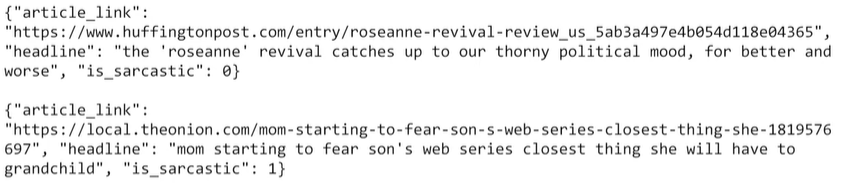
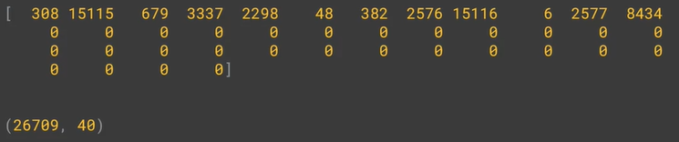

# Practice
Dataset: [Sarcsm in News Headlines Dataset by Rishabh Misra](https://www.kaggle.com/datasets/rmisra/news-headlines-dataset-for-sarcasm-detection)

There are three elements in it: 
* Sarcastic as label
  ```
  is_sarcastic: 1 if the record is sarcastic
  otherwise 0
  ```
* Headline which is just plain text, the headline of the news article
* Article link, link to the original news article



```python
import json

with.open("sarcasm.json", 'r') as f:
    datastore = json.load(f)

sentences = []
labels = []
urls = []

for item in datastore:
    sentences.append(item['headline'])
    labels.append(item['is_sarcastic'])
    urls.append(item['article_link'])
```

## Working with Tokenizer

```python
from tensorflow.keras.processing.text import Tokenizer
from tensorflow.keras.processing.text import pad_sequences

tokenizer = Tokenizer(oov_token="<OOV>")
# generate word index
tokenizer.fit_on_texts(sentence)
# generate key value
word_index = tokenizer.word_index

sequences = tokenizer.texts_to_sequences(sentences)
padded = pad_sequences(sequences, padding='post')
print(padded[0])
print(padded.shape)
```

Output:
