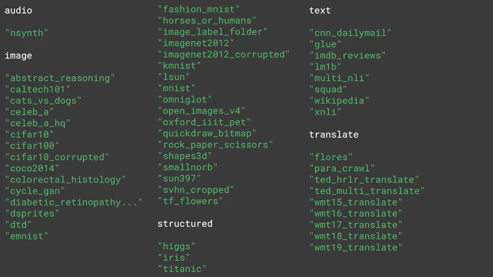

# Word Embeddings

One of the coolest things about word embedding is you can download the pretrained word embedding that maybe someone else has trained.

## TFDS
<p align="center">
    
    <i>Images 1. TensorFlow Data Services</i>
</p>
TFDS contains many datasets and lots of different categories.  

## Looking into Details
```python
import tensorflow as tf
print(tf.__version__)

import tensorflow_datasets as tfds
imdb, info = tfds.load("imdb_reviews", with_info=True, as_supervised=True)

# split data for training and testing
import numpy as np
train_data, test_data = imdb['train'], imdb['test']

training_sentences = []
training_labels = []

testing_sentences = []
testing_labels = []

# each contains 25,000 sentences
# label as sensors
for s, l in train_data:
    training_sentences.append(str(s.numpy()))
    training_labels.append(l.numpy())

for s, l in test_data:
    testing_sentences.append(str(s.numpy()))
    testing_labels.append(l.numpy())

# Convert labels lists to numpy array
training_labels_final = np.array(training_labels)
testing_labels_final = np.array(testing_labels)
```

Sentimen analysis in TensorFlow uses emmedding.
```python
tf.keras.layers.Embedding(vocab_size, emberdding_dim, input_length=max_length)
```

## Use Vectors
The meaning of the words can came from the labeling of the dataset. Resulf of embedding will beb a 2D array with the lenght of sentence. We use embedding layer to represent each word in vocabulary with vectors.

## Ungraded Labs
* Lab 1: [Training a binary classifier with the IMDB Reviews Dataset](https://github.com/https-deeplearning-ai/tensorflow-1-public/blob/main/C3/W2/ungraded_labs/C3_W2_Lab_1_imdb.ipynb)
* Lab 2: [Training a binary classifier with the Sarcasm Dataset](https://github.com/https-deeplearning-ai/tensorflow-1-public/blob/main/C3/W2/ungraded_labs/C3_W2_Lab_2_sarcasm_classifier.ipynb)
* Lab 3: [Subword Tokenization with the IMDB Reviews Dataset](https://github.com/https-deeplearning-ai/tensorflow-1-public/blob/main/C3/W2/ungraded_labs/C3_W2_Lab_3_imdb_subwords.ipynb)

## Wrap Up
Here are the key takeaways for this week:
* You looked at taking your tokenized words and passing them to an Embedding layer.
* Embeddings map your vocabulary to vectors in higher-dimensional space. 
* The semantics of the words were learned when those words were labeled with similar meanings. For example, when looking at movie reviews, those movies with positive sentiment had the dimensionality of their words ending up pointing a particular way, and those with negative sentiment pointing in a different direction. From these, the words in future reviews could have their direction established and your model can infer the sentiment from it. 
* You then looked at subword tokenization and saw that not only do the meanings of the words matter but also the sequence in which they are found. 

## References
* [IMDB Datasets](http://ai.stanford.edu/~amaas/data/sentiment/)
* [TensorFlow Datasets Documentation](https://www.tensorflow.org/datasets/catalog/overview)
* [SubTextEncoder](https://www.tensorflow.org/datasets/api_docs/python/tfds/deprecated/text/SubwordTextEncoder)