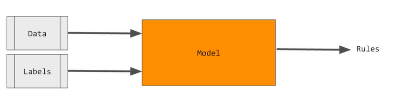
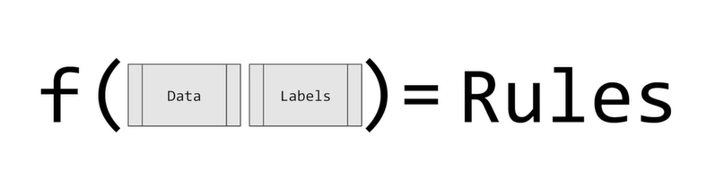
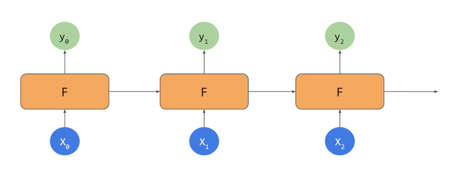
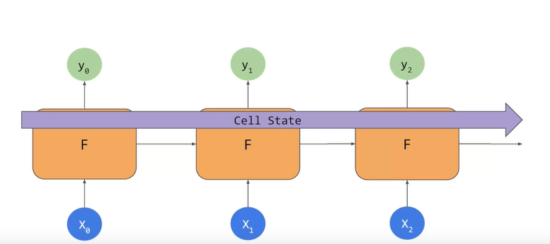
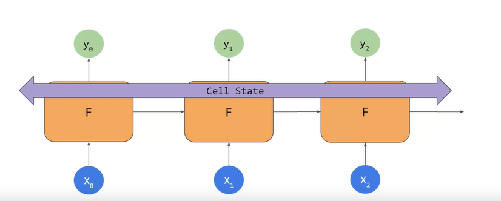
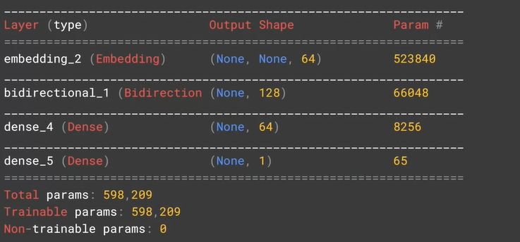
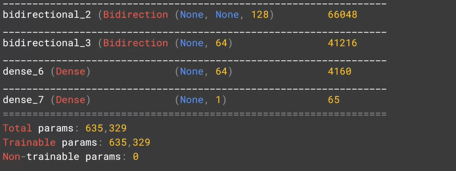
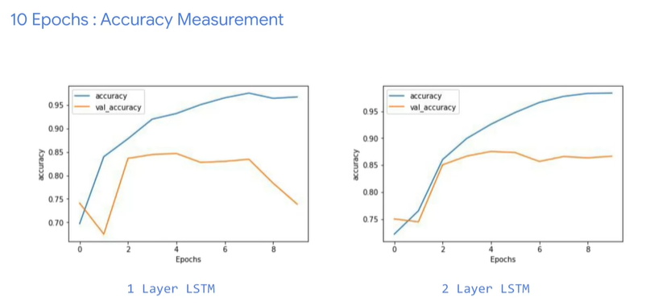
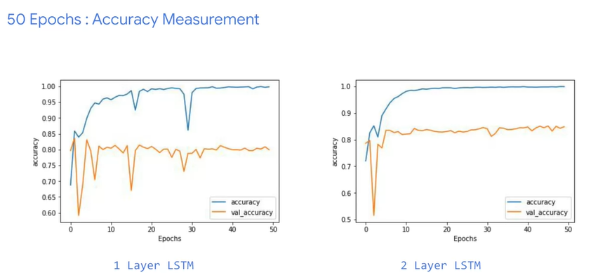
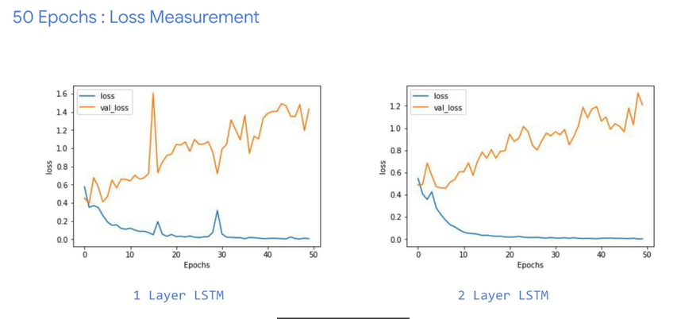

# Sequence Models

## Introduction
The main reason for why  our classifier failed to get any meaningful results was that the context of words was hard to follow when the words were broken down into sub-words and the sequence in which the tokens for the sub-words appear becomes very important in understanding their meaning.

<p align="center">
    
    <i>Images 1. Neural Network</i>
</p>

The neural network is like a function that when you feed it in data and labels, it infers the rules from these, and then you can use those rules. 

<p align="center">
    
    <i>Images 2. Function</i>
</p>

You take the data and you take the labels, and you get the rules. 

<p align="center">
    
    <i>Images 3. RNN</i>
</p>

Basic idea of a recurrent neural network or RNN, which is often drawn a little like this. You have your x as in input and your y as an output. But there's also an element that's fed into the function from a previous function. 

## LSTMs (Long Short-term Memories)
The context word that helps us understand the next word is very close to the word that we're interested in

<p align="center">
    
    <i>Images 4. LSTM</i>
</p>

So, if we're looking at a sequence of words we might lose context. With that in mind an update to RNNs is called LSTM, long short - term memory has been created. In addition to the context being passed as it is in RNNs, LSTMs have an additional pipeline of contexts called cell state. This can pass through the network to impact it. This helps keep context from earlier tokens relevance in later ones.

<p align="center">
    
    <i>Images 5. Bidirection LSTM</i>
</p>

Cell states can also be bidirectional. So later contexts can impact earlier ones as we'll see when we look at the code. 

## Implementing LSTMs in code
```python
model = tf.keras.Sequential([
    tf.keras.layers.Embedding(tokenizer.vocab_size, 64),
    tf.keras.layers.Bidirection(tf.keras.layers.LDTM(64)),
    tf.keras.layers.Dense(64, activation='relu'),
    tf.keras.layers.Dense(1, activation='sigmoid')
])
```

Model Summary:

<p align="center">
    
    <i>Images 6. Model Summary</i>
</p>

You can also stack LSTMs like any other keras layer by using code like this. 
```python
model = tf.keras.Sequential([
    tf.keras.layers.Embedding(tokenizer.vocab_size, 64),
    tf.keras.layers.Bidirection(tf.keras.layers.LSTM(64, retrun_sequences=True)),
    tf.keras.layers.Bidirection(tf.keras.layers.LSTM(32)),
    tf.keras.layers.Dense(64, activation='relu'),
    tf.keras.layers.Dense(1, activation='sigmoid')
])
```

But when you feed an LSTM into another one, you do have to put the return sequences equal true parameter into the first one. This ensures that the outputs of the LSTM match the desired inputs of the next one. Model Summary:

<p align="center">
    
    <i>Images 7. Model Summary 2</i>
</p>

## Accuracy and Loss
<p align="center">
    
    <i>Images 8. One Layer and Two Layer LSTM Accuracy Comparison</i>
</p>
There's not much of a difference except the nosedive and the validation accuracy. But notice how the training curve is smoother

<p align="center">
    
    <i>Images 10. 50 Epoch Accuracy Comparison</i>
</p>
If you look at loss, over the first 10 epochs, we can see similar results.

<p align="center">
    
    <i>Images 10. 50 Epoch Loss Comparison</i>
</p>
Our loss results are similar with the two layer having a much smoother curve. The loss is increasing epoch by epoch. So that's worth monitoring to see if it flattens out in later epochs as would be desired

## Looking into the code
```python
model = tf.keras.Sequential([
    tf.keras.layers.Embedding(vocab_size, embedding_dim, input_length=max_length),
    tf.keras.layers.Bidirectional(tf.keras.layers.LSTM(32)),
    tf.keras.layers.Dense(24, activation='relu'),
    tf.keras.layers.Dense(1, activation='sigmoid')
])
```

## Ungraded Labs
* Lab 1: [IMDB Subwords 8K with Single Layer LSTM](https://github.com/https-deeplearning-ai/tensorflow-1-public/blob/main/C3/W3/ungraded_labs/C3_W3_Lab_1_single_layer_LSTM.ipynb)
* Lab 2: [IMDB Subwords 8K with Multi Layer LSTM](https://github.com/https-deeplearning-ai/tensorflow-1-public/blob/main/C3/W3/ungraded_labs/C3_W3_Lab_2_multiple_layer_LSTM.ipynb)
* Lab 3: [Using Convolutional Neural Networks](https://github.com/https-deeplearning-ai/tensorflow-1-public/blob/main/C3/W3/ungraded_labs/C3_W3_Lab_3_Conv1D.ipynb)
* Lab 4: [Building Models for the IMDB Reviews Dataset](https://github.com/https-deeplearning-ai/tensorflow-1-public/blob/main/C3/W3/ungraded_labs/C3_W3_Lab_4_imdb_reviews_with_GRU_LSTM_Conv1D.ipynb)
* Lab 5: [Sarcasm with Bidirectional LSTM]
* Lab 6: [Sarcasm with 1D Convolutional Layer]

## References
* [Andrew - Sequence Models](https://www.coursera.org/lecture/nlp-sequence-models/deep-rnns-ehs0S)
* [Andrew - LSTM](https://www.coursera.org/lecture/nlp-sequence-models/long-short-term-memory-lstm-KXoay)